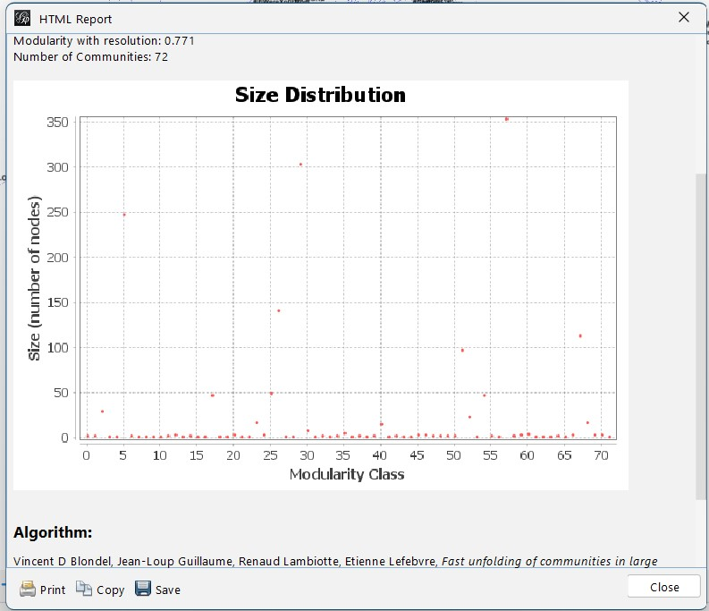
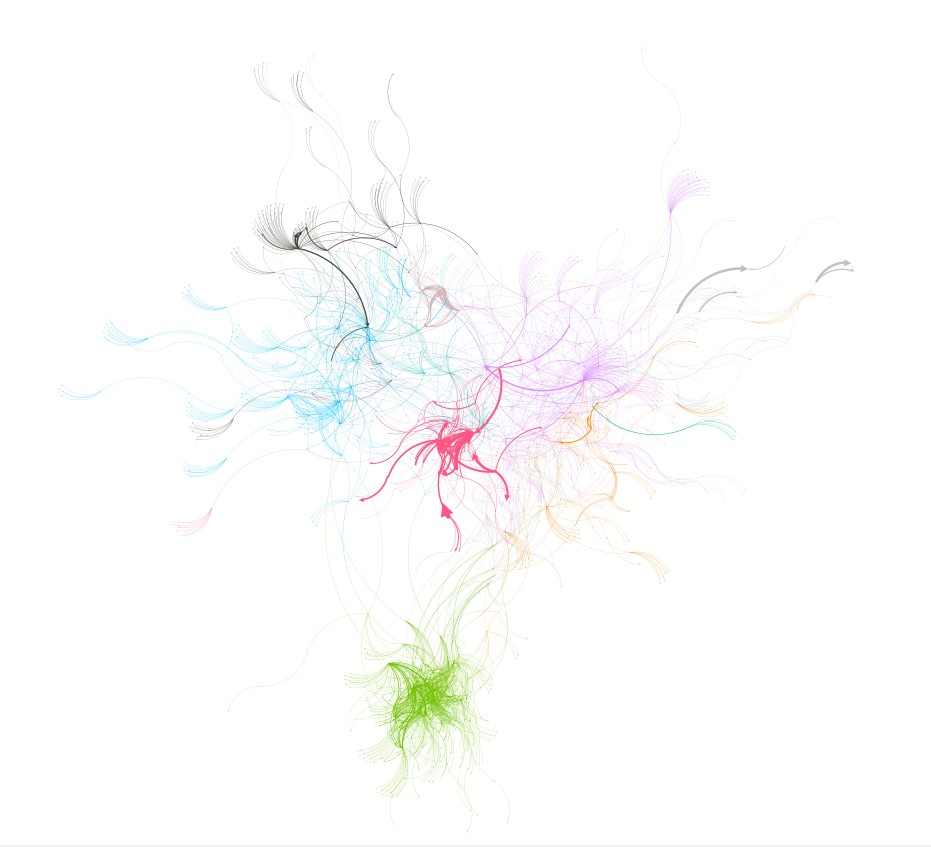
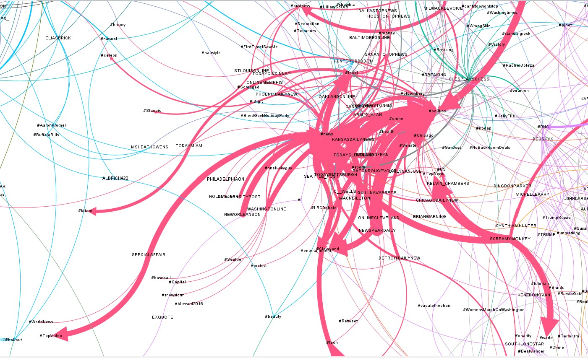
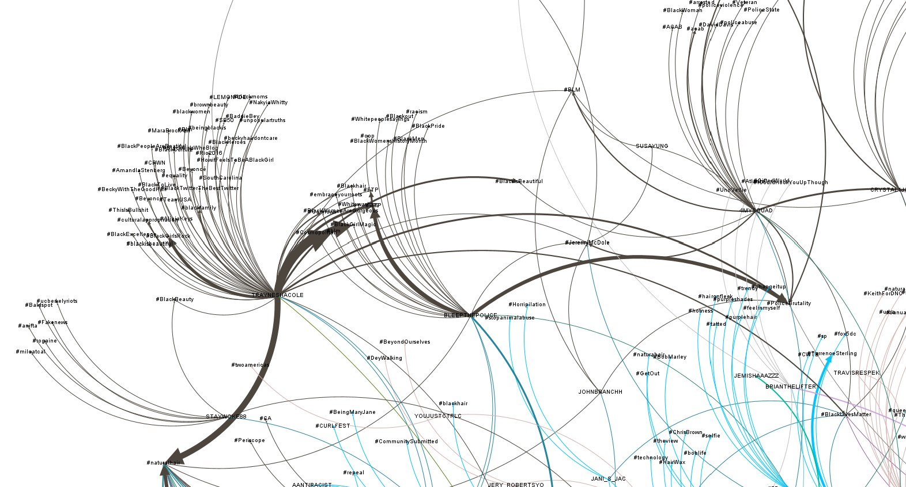
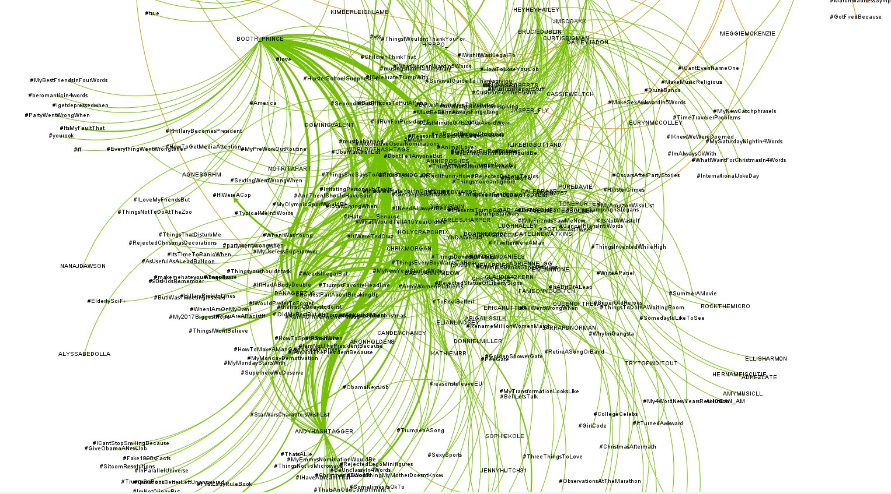
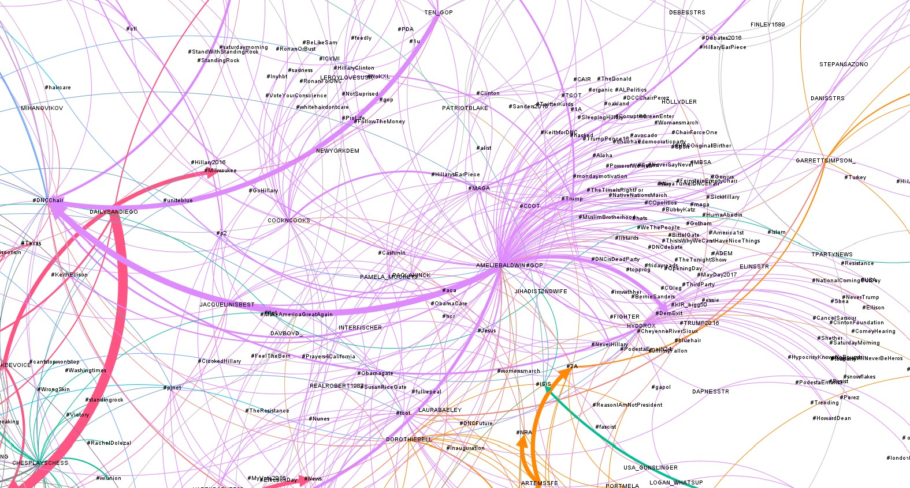
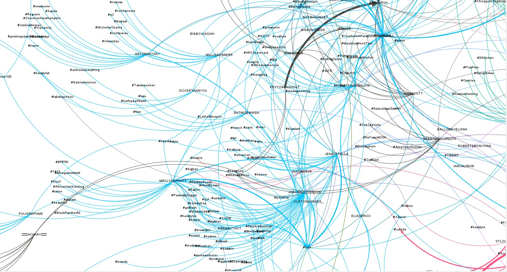

<center>

# Trabajo Final Redes Trolls (Tema Pelo)

# Antonio Payar Sánchez

### Al igual que el anterior trabajo, Este es el segundo trabajo de Análisis de Datos en R de la Asignatura de 3º de Ingeniería de Software en el que también trabajaré con un conjunto de datos relacionado con los bots Rusos involucrados en las elecciones de 2016 donde Donald Trump.

### El objetivo de este trabajo es la exploracion de SNA (Social Network Analisis)

</center>

<p align="center">


</p>

### Procedemos hacer el preprocesado habitual que hemos seguido durante todo el curso

``` r

setwd("C:\\Users\\Recesvinto\\Documents\\ANO 3º\\Busqueda_Informacion\\Social Network Analisis\\SNA_talleR_muRcia-main\\Trabajo_Final")

load("fichero_global.rda")

load("edges.full.RData")
load("nodes_rich.RData")


##QUITAMOS COLUMNAS
df_trolls <- subset(global_def, select = c("author", "content","region","language","publish_date","post_type","account_type","account_category"))


#FACTORIZAMOS

df_trolls$region <- as.factor(df_trolls$region)
df_trolls$language <- as.factor(df_trolls$language)
df_trolls$post_type <- as.factor(df_trolls$post_type)
df_trolls$account_type <- as.factor(df_trolls$account_type)
df_trolls$account_category <- as.factor(df_trolls$account_category)

summary(df_trolls)

#******Fechas
df_trolls$publish_date <- as.Date(df_trolls$publish_date,format = "%m/%d/%Y")


# Nos quedamos solo con los tweats que estan en ingles
datos_filtrados <- subset(df_trolls, language == "English")
```

### En este punto es donde realizamos el filtrado y buscamos tods los elementos del dataframe que contengan la palabra hair para poder estudiarlo

``` r

#---------------------------------Filtrado---------------------

# Encontrar todas las filas donde la columna "content" contiene la palabra "hair"
datos_filtrados <- datos_filtrados[grepl("hair", datos_filtrados$content), ]

# 

------------------------------------------------------------------
```

### En este punto nos encargaremos de crear dos dataframes

### El primero (edges.full) con todos las relaciones que se compondra de nuestro tweet y las diferentes relaciones que lo componene

### El segundo (nodes_rich) sera un dataframe que dentro contendra una columna con todos los autores de los tweets y con los propios hashtags del dataframe anterior

``` r
library(dplyr)
library(stringr)

# Crear una nueva columna en el dataframe para almacenar los hashtags como cadena de texto
datos_filtrados <- datos_filtrados %>% mutate(hashtags = sapply(str_extract_all(content, "#\\w+"), function(x) paste(x, collapse = " ")))

# Filtrar las filas donde la columna "hashtag" no contiene texto
datos_filtrados <- datos_filtrados %>% 
  filter(hashtags != "")


library(tidyr)

# Dividir los hashtags en filas separadas
edges.full <- datos_filtrados %>% 
  separate_rows(hashtags, sep = " ")

# Cambiar la posición de la última columna
edges.full <- edges.full %>% 
  select(author, hashtags, everything())


# Obtener los nombres distintos
nombres_distintos <- unique(edges.full$author)

# Crear un nuevo dataframe con los nombres distintos
nodes_rich <- data.frame(author = nombres_distintos)

# Obtener todos los elementos no repetidos de la columna "hashtags"
hashtags_unicos <- unique(unlist(edges.full$hashtags))

# Crear un nuevo dataframe con los elementos únicos de hashtags y los nombres de autor en nodes_rich
nuevo_nodes_rich <- data.frame(author = c(nodes_rich$author, hashtags_unicos))

```

### Por ultimo exportamos nuestro dataframe diferenciando los correspondientes nodos con sus relaciones

``` r
#----------------------Gephi-------------------------

library(igraph)

save(edges.full, file = "edges.full.RData")
save(nodes_rich, file = "nodes_rich.RData")
save(nuevo_nodes_rich, file = "nuevo_nodes_rich.RData")

#Creamos el objeto de igraph
network.full <- graph.data.frame(edges.full[,c("author",
                                               "hashtags",
                                               "content",
                                               "publish_date",
                                               "account_category")],
                                 directed = TRUE,
                                 vertices = nuevo_nodes_rich)

V(network.full)[1:10]
E(network.full)[1:10]


write.graph(network.full,
            file = "troll_twitter_america.graphml",
            format = "graphml")

save.image("00_grafo_base.rda")
```
<center>

# GEPHI




### Una vez que hemos exportado el grafo y reajustado tanto la posición como el color, seleccionamos la opción de modularidad para diferenciar el conjunto de comunidades. De esta manera, obtenemos un grafo como el siguiente:



### Como podemos apreciar a simple vista, Gephi ha identificado numerosas comunidades en nuestro análisis. Además, destaca la importancia del tamaño del conjunto de perfiles. Cabe recordar que estábamos trabajando con un subconjunto del archivo de los trolls, que consta de menos de mil tweets. Como podemos observar, el grafo de las relaciones entre hashtags y personas es de gran magnitud

### Vamos a estudiar mas detenidamente alguna de las principales comunidades que lo forma :

# COMUNIDAD ROJA



### A simple vista, resulta evidente la notable participación de esta comunidad roja en la red en general. Lo más destacado es la interconexión lineal de los hashtags, lo cual permite apreciar cómo los usuarios que debaten sobre un tema específico, como #politics, agregan otros hashtags relacionados en el mismo tweet. Esta sinergia entre los usuarios demuestra el compromiso y la amplitud de intereses dentro de esta comunidad en particular con temas relacionados con: #news \# crime #local #Chicago...

### Como se puede apreciar, en esta comunidad se observa principalmente una inclinación hacia los temas relacionados con la actualidad política, las noticias y, en general, ese tipo de temáticas."

### Algunos hashtags que he podido identificar y que podrían captar nuestra atención son:

-   #blizzar2019
-   #BlerdHolidayPartty
-   #HillarySoOld
-   #WrongSkin

# COMUNIDAD NEGRA (Afroamericanos , Belleza)



### Este es otra de las comunidades que mas me ha llamado la atencion.

### Dado que, al igual que la comunidad roja, se podía hilvanar perfectamente los temas que se trataban y, sobre todo, la cadena que seguramente repetían constantemente, en este caso nos encontramos con una situación similar. Podemos observar cómo figuras prominentes como TRAYNESHACOLE y 4MYSQUAD eran los principales impulsores de esta comunidad. Lo más interesante de todo son los temas que abordaban, ya que se puede apreciar una gran influencia en asuntos relacionados con la belleza y la salud, haciendo especial hincapié en la comunidad afroamericana. Resulta evidente el uso abusivo de hashtags como:

-   #BlackExcellence
-   #BlackWithTheGoodHair
-   #BlackPeopleAreBeautiful
-   #HowitFeelsToBeABlackGil
-   #BlackHeroes
-   #embaraseyourtoots

### Entre los hashtags curiosos que se encuentran en esta comunidad, destacan aquellos que mencionan a reconocidos actores y actrices de la comunidad afroamericana, como Beyoncé y las Kardashian.

# COMUNIDAD VERDE (Rightroll , Trump)



### Esta comunidad es la más complicada de interpretar, dado que existe una gran cantidad de relaciones y, sobre todo, lo más importante, es sumamente caótica. He intentado probar con diferentes layouts para lograr que sea más legible, pero no he tenido éxito. No obstante, podemos identificar varias características a simple vista:

### La complejidad de las relaciones entre los miembros de la comunidad es notable.

### El caos imperante dificulta la comprensión y el seguimiento de los eventos.

### Es evidente la necesidad de implementar estrategias para mejorar la legibilidad y la organización.

### Estos son solo algunos aspectos observables en primera instancia, lo que demuestra la complejidad inherente a esta comunidad en particular."

### Esta comunidad se distingue principalmente por la interacción de diversos individuos. Entre ellos, destacan personalidades reconocidas como... BOOTH_PRINCE , ANDYHASTAGGER , CHRIXMORGAN, WORLDOSHASHTAGS.

### Podemos observar a los usuarios más participativos en esta comunidad, especialmente a través del conjunto de hashtags que he podido identificar. Considero que esta comunidad se especializa en abordar temas relacionados con la ACCOUNT_CATEGORY de RIGTH_TROLL, dada la naturaleza de los temas de discusión. Desde mi perspectiva, se tratan de temas comunes y recurrentes dentro de esta comunidad, sin mencionar la notable presencia de hashtags de apoyo a Trump.

### Algunos de estos son :

-   #ThingslWontBeliece
-   #YouAreRacist
-   #GiveObamaNewJob
-   #ArmyWomenProblems
-   #ThingsEverBoyWantsToHear
-   #PresidentTrump
-   #RejectedStatueOfLiberty

# COMUNIDAD MORADA (Lefttroll ,Hillary)



### Tanto esta comunidad como la comunidad verde me desconciertan un tanto, ya que aunque comprendo claramente los temas sobre los que debaten, me resulta difícil asociarlos con un espectro político en particular. Por ejemplo, esta comunidad parece estar claramente relacionada con la categoría ACCOUNT_CATEGORY de LEFT_TROLL, sin embargo, los temas que discuten me llevan a pensar que podrían ser los de RIGHT_TROLL, criticando a sus 'adversarios ideologicos'.

### Aun así, es innegable, como lo evidencian los hashtags que circulan, que los temas abordados por esta comunidad pertenecen a la esfera de Hillary Clinton y anti Trump. En general, al ámbito demócrata, tales como:

-   #GoHilary
-   #VoteYourConscience
-   #ProLife
-   #FollowTheMoney
-   #Clinton
-   #TrumpPence16
-   #WomansMarch
-   #MuslimsBrotherhood
-   #libatards
-   #BernieSanders
-   #Obamagate

# COMUNIDAD AZUL (Pelo , Belleza)



### Esta comunidad se destaca por su estrecha relación con el tema seleccionado del cabello y la belleza. En definitiva, se sumerge en una dinámica de temas curiosos y peculiares dentro del ámbito del dataframe. Cabe destacar que esta vibrante comunidad azul está profundamente conectada con la comunidad negra mencionada al comienzo de este trabajo. De hecho, si observamos los dos nodos principales en la imagen, uno de ellos es "#hair", del cual surge prácticamente toda la comunidad, y el otro es "#naturalhair", que actúa como un puente entre ambas comunidades.

### Podemos observar cómo algunos de los participantes más notorios de esta comunidad son JADONHUTCHINSON y JEANUTELLA. Además, destacan algunos de los hashtags más llamativos, tales como:

-   #hair
-   #shorthair
-   #blackart
-   #brownskin
-   #darkskin
-   #womanofcolor
-   #afro
-   #natural

# CONCLUSION FINAL

</center>

### Antes de finalizar el trabajo, deseo expresar mi sincero agradecimiento por la oportunidad este año de tener esta asignatura junto a usted.

### Considero esta asignatura como una de las más fascinantes de este tercer año de INSO. En realidad, he descubierto un mundo sumamente cautivador y entretenido que desconocía por completo: el Análisis de Datos y, sobre todo, la programación asociada a ello y si no hubiera sido por sus clases no me hubiera dado cuenta de ello.

### Muchísimas Gracias Pedro.

### Para concluir con el trabajo, me gustaría expresar que el enfoque renovado que he aplicado en la primera práctica con la tecnología de Análisis de Redes Sociales (SNA) ha sido sumamente interesante. En particular, considero que ha brindado una perspectiva fascinante sobre el comportamiento de estos individuos "trolls" y como trabajaban.

### Tras analizar detenidamente las comunidades, he llegado a varias conclusiones significativas. Es evidente que tenían un plan de acción meticulosamente diseñado. Sabían que ciertos usuarios debían infiltrarse en determinadas 'comunidades' y, lo que es más importante, conocían la manera de hacerlo sin llamar demasiado la atención. En la red, se aprecia claramente cómo los hashtags se dividen según temas específicos, diferenciando comunidades por su ideología, etnia e incluso género. Además, resulta interesante observar cómo lograban interconectar dos comunidades que aparentemente no guardaban relación alguna. Esto se evidenciaba por el conjunto de hashtags utilizados y, sobre todo, por su orden estratégico.

### Con lo mencionado anteriormente, solo me resta concluir cómo un subconjunto aparentemente "insignificante" como el "pelo" revela de manera tan clara estas diferencias. Me insta a reflexionar sobre otros temas mucho más polémicos y conflictivos, como "ISIS", "Corea del Norte" o incluso "Trump". No obstante, el código está completamente funcional y, si en algún momento decide querer utilizarlo para explorar otros temas de mayor interés, simplemente modificando el "filtro", funcionará. Aunque esta comunidad, que no es muy numerosa en mi ordenador, ha causado ciertos contratiempos al trabajar con ella en Gephi..
