# ANTONIO PAYAR SÁNCHEZ
# INSO 3º DATA

###  Esto es uno de los primeros trabajos que se desarrolló en 3º de Ingeniería de Software con el objetivo de explorar y analizar los datos en el lenguaje de R, un conjunto de datos relacionado con los bots Rusos involucrados en las elecciones de 2016 donde Donald Trump sale electo.

### Dado que el dataset era suficientemente grande, el profesor nos permitió hacer un trabajo exploratorio del tema que más nos interesase, por eso mismo se me ocurrió ver cuál fue el impacto del conocido y polémico tema de su pelo y como este impacto respecto los tweets de los Bots Rusos.

### Este primer notebook se fundamenta en aplicar los conocimientos relacionados con:
- Análisis y exploración de datos en R
- Preprocesamiento de datos en R
- Aplicar modelos de NLP como Sentiment Analisis en R
- Realización de wordclouds en R

# TEMAS RAROS (PELO) TWITTER

<center>
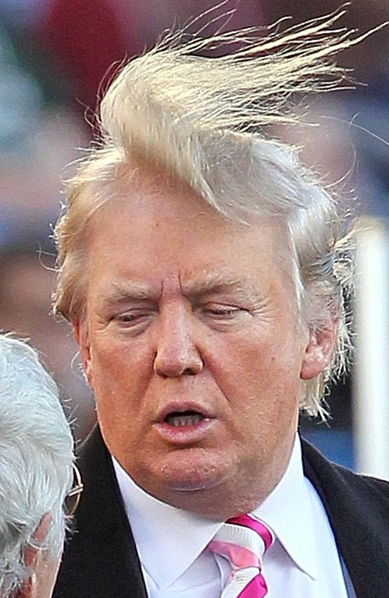
</center>

## CREACIÓN DATASET

### LIBRERÍAS Y DIRECTORIO
```r

library(quanteda)
library(quanteda.textplots)
library(stringr)
setwd("C:\\Users\\Recesvinto\\Documents\\ANO 3º\\Busqueda_Informacion\\TRABAJO\\")

ficheros_csv <- list.files(path="tweets\\", pattern="*.csv")
```

### LECTURA TWEETS
```r
data_frame_troll <- data.frame()

for (i in ficheros_csv){
  lectura <- read.csv(paste0("tweets/",i),header = TRUE,sep = ",")
  print(nrow(lectura))
  data_frame_troll <- rbind(lectura,data_frame_troll)
}

print(nrow(data_frame_troll))

names(data_frame_troll)
```

### LIMPIEZA DATASET

```r
##QUITAMOS COLUMNAS
df_trolls <- subset(data_frame_troll, select = c("author", "content","region","language","publish_date","post_type","account_type","account_category"))

#FACTORIZAMOS
df_trolls$region <- as.factor(df_trolls$region)
df_trolls$language <- as.factor(df_trolls$language)
df_trolls$post_type <- as.factor(df_trolls$post_type)
df_trolls$account_type <- as.factor(df_trolls$account_type)
df_trolls$account_category <- as.factor(df_trolls$account_category)

summary(df_trolls)

#Fechas
df_trolls$publish_date <- as.Date(df_trolls$publish_date,format = "%m/%d/%Y")


# Nos quedamos solo con los tweats que estan en ingles
datos_filtrados <- subset(df_trolls, language == "English")

save(datos_filtrados,file = "datos_filtrados.rda")


#Vamos a limpiar el dataset de caracteres raros 
datos_filtrados$content <- str_replace_all(datos_filtrados$content, 
                                                 pattern = "https?://([^/\\s]++)\\S*+|http?://([^/\\s]++)\\S*+",
                                                 replacement = "")

#Limipiamos el dataset de links,@..
datos_filtrados$content <- gsub("(#\\w+)|(http\\S+)|(https\\S+)|(&amp;)|(@\\w+)|(RT)", "", datos_filtrados$content)
# Hacemos lowercase
datos_filtrados$content <- tolower(datos_filtrados$content)
# Limpiamos emojis y characteres raros
datos_filtrados$content <- gsub("[\\x{1F600}-\\x{1F6FF}|\\x{2600}-\\x{26FF}|\\x{2700}-\\x{27BF}|\\x{1F300}-\\x{1F5FF}|\\x{1F680}-\\x{1F6FF}|\\x{1F1E0}-\\x{1F1FF}|\\x{1F900}-\\x{1F9FF}|\\x{1F7E0}-\\x{1F7FF}|\\x{1F918}]", "", datos_filtrados$content, perl=TRUE)
datos_filtrados$content <- gsub("[^[:alnum:][:space:]]", "", datos_filtrados$content, perl=TRUE)

#Buscamos si ha quedado relativamente limpio
grep(pattern = "http",datos_filtrados$content,perl = T)
grep(pattern = "#",datos_filtrados$content,perl = T)

#Salvamos el objeto
save(datos_filtrados,file = "datos_filtrados.rda")
```

### BUSCAMOS HAIR LOSS
```r
# Temas "raros" (pelo, perder peso...)
indices <- grep("hair loss",datos_filtrados$content)

# Tomar los primeros X índices encontrados
primeros_X <- head(indices, 50)
```
#### Estos son los únicos resultados relacionados con hair loss.
#### Dado que el conjunto de estudio es muy pequeño vamos a analizar las implicaciones relacionadas con el Pelo.
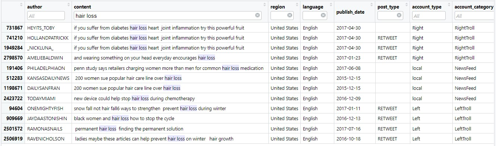

### LIMPIEZA DEL DATASET HAIR
```r
#Lo primero que tenemos que hacer es quitar las palabras que sean simialer a hair pero que no tengan nada que ver
# Para poder estudiar lo mejor posible el texto

# Definir las palabras que queremos eliminar
palabras_eliminar <- c("chair", "gopchairwoman","chairman","chairwoman","hairim","hairdresser","wheelchair","chairmnoomowmow","spectorhairday","conniehair","gopchairwoman","kayhair1","chairwho","strathairn","hairraising","hairband")

# Función para eliminar las palabras
eliminar_palabras <- function(texto, palabras) {
  texto_limpio <- gsub(paste(palabras, collapse = "|"), "", texto)
  return(texto_limpio)
}

# Aplicar la función a la columna texto del dataset
datos_filtrados$content <- sapply(datos_filtrados$content, eliminar_palabras, palabras = palabras_eliminar)

#Ahora vamos a coger la muestra que solo hable de los temas relacionados con el "hair"
datos_filtrados <- subset(datos_filtrados, grepl("hair", datos_filtrados$content))

#Salvamos el Objeto
save(datos_filtrados,file = "datos_filtrados_hair.rda")
```
#### Una vez tenemos nuestro dataset lo más limpio de: (palabras similares, @, #, RTs ..etc).

#### Vamos a buscar las diferentes aplicaciones de los términos relacionados con el "pelo" y los diferentes usos que hacen con él.

#### He observado como que las principales categorías que usan términos relacionados con el "pelo" son RigthTroll y LeftTroll

#### Vamos a crear dos dataset diferenciados para cada uno de ellos

```r
# RigthTroll
# Nos quedamos solo con los tweats de RigthTroll
ds_right_hair <- subset(datos_filtrados, account_category == "RightTroll")

save(ds_right_hair,file = "ds_right_hair.rda")
```

### VAMOS A BUSCAR LOS TOKENS MÁS PREDOMINANTES

#### Necesitamos un CORPUS para crear un BIGRAMA


```r

#CREAMOS UN CORPUS
#Un corpus es como un dataframe codificado, lo necesitamos codificado para llamar a funciones de alto nivel matematicas
#Necesitamos funciones matematicas para mineria de texto
corpus_right_hair <- quanteda::corpus(ds_right_hair$content)

docvars(corpus_right_hair, "account_category") <- ds_right_hair$account_category
docvars(corpus_right_hair, "account_type") <- ds_right_hair$account_type
docvars(corpus_right_hair, "lengua") <- ds_right_hair$language
docvars(corpus_right_hair,"fecha") <- ds_right_hair$publish_date
docvars(corpus_right_hair,"autor") <- ds_right_hair$author
docvars(corpus_right_hair,"region") <- ds_right_hair$region
docvars(corpus_right_hair,"post_type") <- ds_right_hair$post_type

summary(corpus_right_hair)


#Asignamos tokens (elemento suele ser una palabra)
trolls_corpus_right_hair <- tokens(corpus_right_hair)

#kwic busca todos los mensajes relacionados con el token hair
hair_tweets <- kwic(trolls_corpus_right_hair,"hair")
View(hair_tweets)

#Vamos a limpiar nuestro corpus de : numeros, simbolos,url...
tok_tweets <-quanteda::tokens(corpus_right_hair,
                              what = "word",
                              remove_numbers = TRUE,
                              remove_punct = TRUE,
                              remove_symbols = TRUE,
                              remove_separators = TRUE,
                              remove_url = TRUE)


# tokens_select hace un filtrado tanto para buscar como para eliminar
#*Queremos quitar las stopwords del Ingles como : preposiciones o i´ve,when only..
#*
tok_tweets <-tokens_select(tok_tweets,
                           pattern = stopwords("en"),
                           selection = "remove")

#Hacemos matrices de frecuencia que contienen tokens y su aparicion en el dataset
myStemMat <-dfm(tok_tweets)

#Mostramos las palabras que mas aparecen 
topfeatures(myStemMat,100)

#Hacemos un bigrama
tok_tweets_2 <- tokens_ngrams(tok_tweets, 
                              n = 2)
#Hacemos un bigrama
myStemMat <- dfm(tok_tweets_2)

#Sacamos el 100 top words
topfeatures(myStemMat,100)


#Creamos semilla para crear una imagen 
set.seed(100)
png(filename="hair_right.png",
    width=3000,
    height=3000)

textplot_wordcloud(myStemMat, 
                   min_count = 10, 
                   random_order = FALSE,
                   rotation = 0,
                   color = RColorBrewer::brewer.pal(8,"Dark2"))

#Cerramos la conexion para que se cree la imagen png
dev.off()
```

# RigthTroll
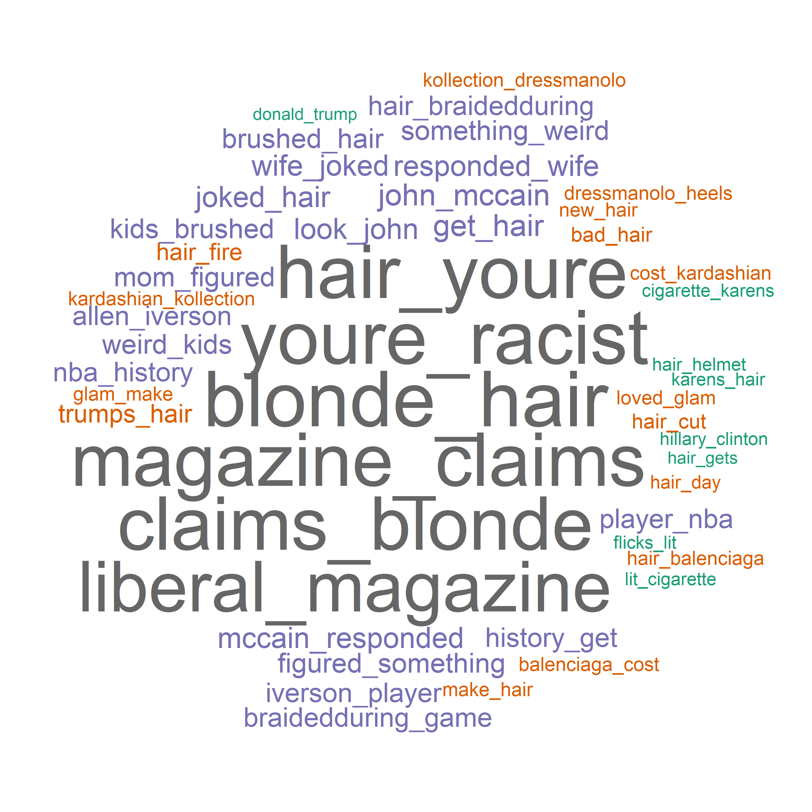


### VAMOS A REALIZAR LO MISMO PERO CON LEFTROLL

```r
# LeftTroll
load("datos_filtrados.rda")

# Nos quedamos solo con los tweats LeftTroll
ds_left_hair <- subset(datos_filtrados, account_category == "LeftTroll")

save(ds_left_hair,file = "ds_left_hair.rda")
```

```r
#CREAMOS UN CORPUS
corpus_left_hair <- quanteda::corpus(ds_left_hair$content)

docvars(corpus_left_hair, "account_category") <- ds_left_hair$account_category
docvars(corpus_left_hair, "account_type") <- ds_left_hair$account_type
docvars(corpus_left_hair, "lengua") <- ds_left_hair$language
docvars(corpus_left_hair,"fecha") <- ds_left_hair$publish_date
docvars(corpus_left_hair,"autor") <- ds_left_hair$author
docvars(corpus_left_hair,"region") <- ds_left_hair$region
docvars(corpus_left_hair,"post_type") <- ds_left_hair$post_type

summary(corpus_left_hair)


#******Asignamos tokens (elemento suele ser una palabra)
trolls_corpus_left_hair <- tokens(corpus_left_hair)

#******kwic busca todos los mensajes relacionados con el token hair
hair_tweets <- kwic(trolls_corpus_left_hair,"hair")
View(hair_tweets)

#******Vamos a limpiar nuestro corpus de : numeros, simbolos,url...
tok_tweets <-quanteda::tokens(corpus_left_hair,
                              what = "word",
                              remove_numbers = TRUE,
                              remove_punct = TRUE,
                              remove_symbols = TRUE,
                              remove_separators = TRUE,
                              remove_url = TRUE)


#****** tokens_select hace un filtrado tanto para buscar como para eliminar
#*Queremos quitar las stopwords del Ingles como : preposiciones o i´ve,when only..
#*
tok_tweets <-tokens_select(tok_tweets,
                           pattern = stopwords("en"),
                           selection = "remove")

#******Hacemos matrices de frecuencia que contienen tokens y su aparicion en el dataset
myStemMat <-dfm(tok_tweets)

#******Mostramos las palabras que mas aparecen 
topfeatures(myStemMat,100)

#Hacemos un bigrama
tok_tweets_2 <- tokens_ngrams(tok_tweets, 
                              n = 2)
#Hacemos un bigrama
myStemMat <- dfm(tok_tweets_2)

#Sacamos el 100 top words
topfeatures(myStemMat,100)


#Creamos semilla para crear una imagen 
set.seed(100)
png(filename="hair_left.png",
    width=3000,
    height=3000)

textplot_wordcloud(myStemMat, 
                   min_count = 10, 
                   random_order = FALSE,
                   rotation = 0,
                   color = RColorBrewer::brewer.pal(8,"Dark2"))

#Cerramos la conexion para que se cree la imagen png
dev.off()
```
# LeftTroll
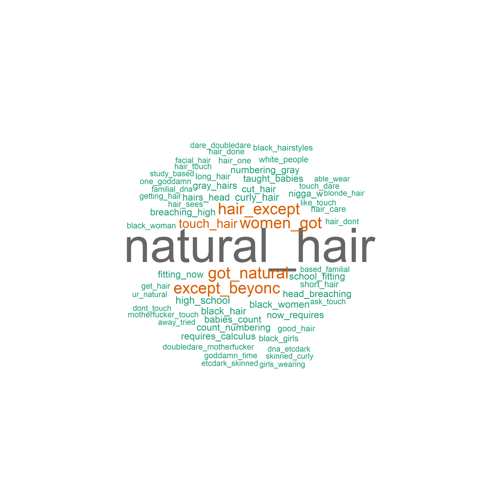


### ANÁLISIS DE SENTIMIENTO

#### Una vez hemos visto cuáles son los principales tokens del dataset dependiendo del "account category" 

#### Podemos ver dos grandes diferencias a primera vista: 

#### Vemos como los tweats relacionados con RigthTroll hablan principalmente de temas relacionados con:
- Racismo
- Rubios
- John Mccain
-  Pelo de Trump
- Liberales ...

#### Mientras que por el lado LeftTroll los principales tweats estan relacionados con:
- Pelo Natural 
- Ser natural 
- Las mujeres tienen.. 
- Mujeres Negras 
- Pelo rizado  ...

#### Vemos que ambos dataset estan demasiado polarizados por lo que vamos a realizar un Análisis de Sentimientos de los mismos para ver que temas tratan y la transcendencia de los mismos respecto a las elecciones de Trump del 2016


```r
library(tidytext)
library(tidyverse)
library(syuzhet)
library(dplyr)
library(textdata)
library(ggplot2)
#install.packages("syuzhet")
#install.packages("textdata")
```

```r
### Analisis de Sentimientos
load("ds_right_hair.rda")

#Añadimos una columna que tenga un id
ds_right_hair <- ds_right_hair %>%
  mutate(tweet_id = row_number())

blonde <- ds_right_hair

# Dividir los tweets en palabras y crear un tidy dataset
ds_tweets_tidy <- blonde %>% 
  unnest_tokens(word, content)

#Aplicamos un Analisis de sentimiento a esos Tweets
#En este caso vamos hacer un Inner Join del contenido de los tweets y añadirle el resultado del analis de sentimiento
tweets_sentiment <- ds_tweets_tidy %>% 
  inner_join(get_sentiments("afinn"), by = "word") %>%
  inner_join(blonde %>% select(tweet_id, content), by = "tweet_id") %>%
  group_by(doc_id = tweet_id) %>% 
  summarise(sentiment = sum(value), text = first(content))

#Mostramos los resultados
tweets_sentiment %>% 
  arrange(desc(sentiment))
```
#### Hemos analizado los sentimientos de dataset RigthTroll con una función de la librería tidytext de que devuelve un conjunto de palabras y su valor de sentimiento asociado en la base de datos AFINN. 

#### AFINN es un diccionario de palabras en inglés con valores de sentimiento que van desde -5 (más negativo) hasta +5 (más positivo).

#### De tal manera que se nos queda una objeto tweets_sentiment con la siguiente forma: ..

| doc_id    | sentiment | text      |
|-----------|-----------|-----------|
|       1   | 3         | you just slim jesus w hair|
|   1104   |1       | yes their hair is so full of life|
|   ..   |..       | ..|

#### Vamos a realizar unos gráficos para ver que tipo de sentimientos predomina en ambos lados del account category

### CREACIÓN DE GRÁFICOS

```r
# Crear el gráfico de puntos
ggplot(data = tweets_sentiment, aes(x = sentiment)) + 
  geom_bar(color = 'darkslategray', fill = 'steelblue') + 
  xlab("Sentimiento") + 
  ylab("Cantidad de Tweets") + 
  ggtitle("Gráfico de Barras")

```
# RigthTroll Sentiment
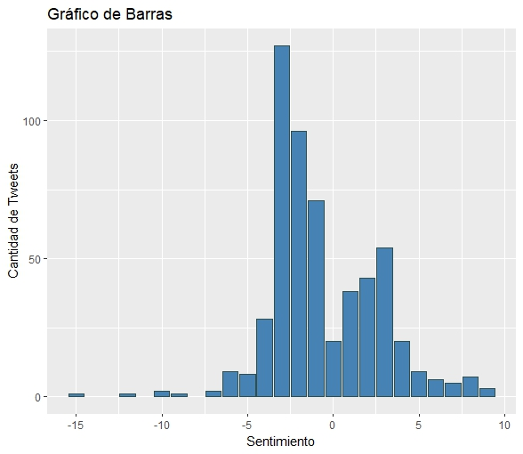

#### Como podemos observar a primera vista con el grupo RigthTroll se ve que predominan los tweats con sentimientos negativos teniendo un pico en él (-3) y llegando incluso hasta valores mínimos como (-15) aun así aunque los tweats positivos parezcan menos están bastante más repartidos.


#### Vamos a proceder a estudiar dichos tweats para saber sobre qué temas están relacionados:

# RigthTroll Sentiment Negative
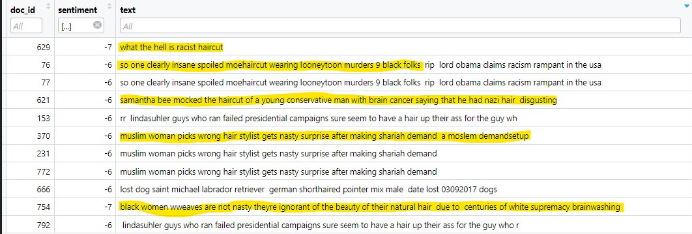

#### He seleccionado una pequeña muestra de tweats categorizados como negativos para saber sobre qué temas trata
#### Los principales comentarios de la muestra como podemos ver hablan de:

- Cortes de pelo racistas
- Asesinatos de poblacion negra e incremento de racismo
- Comentarios de indole racista sobre la poblacion Arabe y Afroamericana.
- Sobre canones de belleza Afoamericana discriminados
- ...

# RigthTroll Sentiment Positive

#### Vamos a proceder a estudiar los tweats de RigthTroll que se han categorizado como positivos.
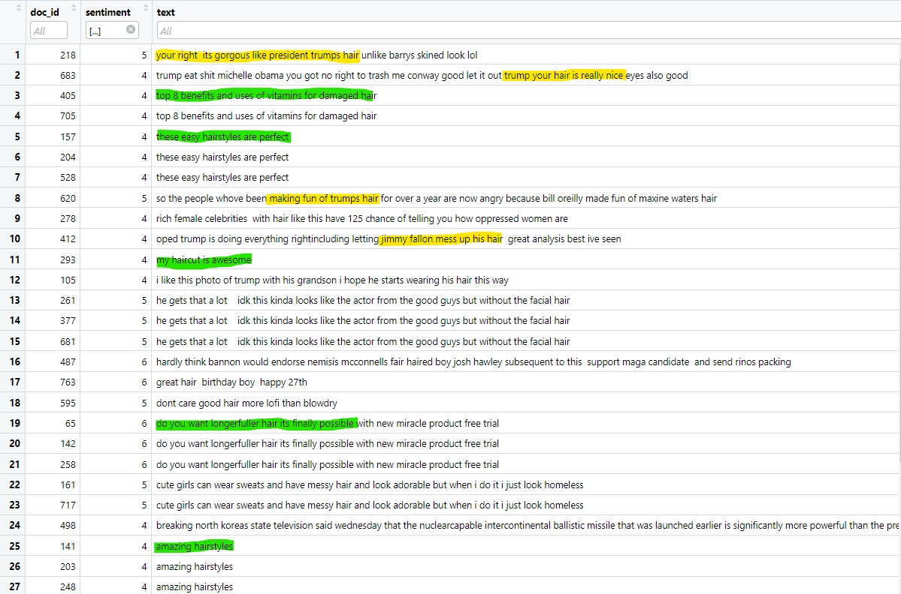

#### En este caso vemos ciertos comentarios cuanto menos interesantes con el caso de estudio en cuestión (Elecciones de 2016).

#### Vemos como se habla sobre:
- El increíble pelo de Trump comparado con una tal Barrys ***(Maryanne Trump Barry)***

***(Maryanne Trump Barry) Hubo unas polémicas con ciertas grabaciones que se filtraron donde su propia hermana hablaba muy mal de Donald Trump haciendo graves acusaciones sobre él .***

- Comentarios apoyando Trump y su pelo y criticando a ***Bill o'reilly (Presentador de TV)***

- Comentarios sobre el show de ***Jimmy Fallon(Presentador de TV)*** y cuando agito su pelo

- Tweats genéricos acerca del cuidado del pelo y beneficios para el mismo ***(Subrayados en verde)***

- ...

### ANÁLISIS DE SENTIMIENTO LEFTROLL


```r
### Analisis de Sentimientos
load("ds_left_hair.rda")

#Añadimos una columna que tenga un id
ds_left_hair <- ds_left_hair %>%
  mutate(tweet_id = row_number())

blonde <- ds_left_hair

# Dividir los tweets en palabras y crear un tidy dataset
ds_tweets_tidy <- blonde %>% 
  unnest_tokens(word, content)

#Aplicamos un Analisis de sentimiento a esos Tweets
#En este caso vamos hacer un Inner Join del contenido de los tweets y añadirle el resultado del analis de sentimiento
tweets_sentiment <- ds_tweets_tidy %>% 
  inner_join(get_sentiments("afinn"), by = "word") %>%
  inner_join(blonde %>% select(tweet_id, content), by = "tweet_id") %>%
  group_by(doc_id = tweet_id) %>% 
  summarise(sentiment = sum(value), text = first(content))


#Mostramos los resultados
tweets_sentiment %>% 
  arrange(desc(sentiment))


# Crear el gráfico de puntos
ggplot(data = tweets_sentiment, aes(x = sentiment)) + 
  geom_bar(color = 'darkslategray', fill = 'steelblue') + 
  xlab("Sentimiento") + 
  ylab("Cantidad de Tweets") + 
  ggtitle("Gráfico de Barras")
```

#### Al igual que hemos hecho con los tweats de RigthTroll vamos aplicar el mismo procedimiento pero con el subconjunto de LeftTroll.


# LeftTroll Sentiment
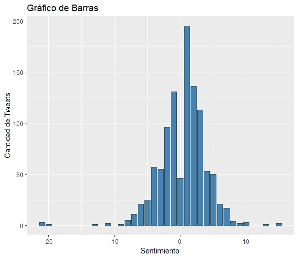

#### En este caso a priori vemos que pasa lo contrario.
#### Hay una predominancia de tweats positivos frente a los negativos habiendo un pico en (+1) aun así algo que podría llamar la atención es como en este subconjunto "LeftTroll" vemos como hay mínimas de hasta (-21) dato sorprendente cuanto menos comparado con el anterior que no llegaba hasta tal extremo. Tambien podemos observar máximas de (+14).

#### Vamos a proceder a estudiar dichos tweats para saber sobre qué temas están relacionados:

# LeftTroll Sentiment Negative
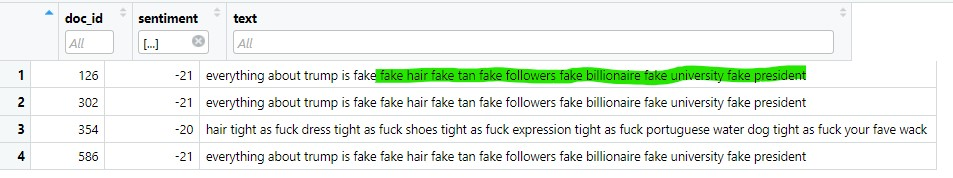

#### He querido ver cuáles eran los tweats peor categorizados y como podemos observar son tweats donde la palabra "fake y fuck" son predominantes y sobre todo tweats hablando de Trump

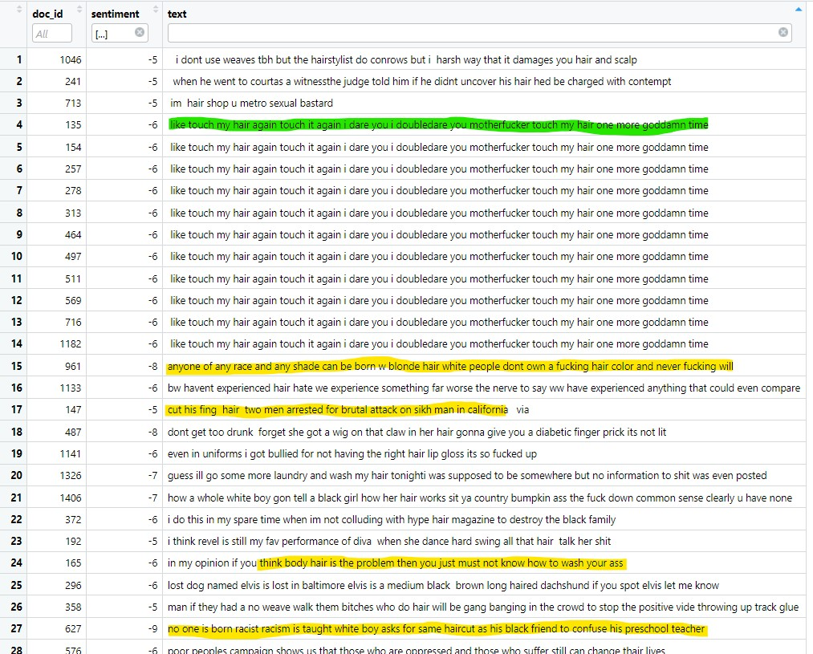
#### La muestra de tweats categorizados como negativos hablan de los siguientes temas:

#### Los principales comentarios como podemos ver hablan de:

- Tweats genéricos en forma de amenaza ***(Subrayados en verde)***

- Tweats racistas hacia la población blanca Estadounidense

- Tweats hablando de posible violencia policial

- Tweats hablando de "body positive" posiblemente femenino

- Tweats hablando de como el racismo es algo que se desarrolla en la sociedad

- Temas de Racismo en general ...


# LeftTroll Sentiment Positive

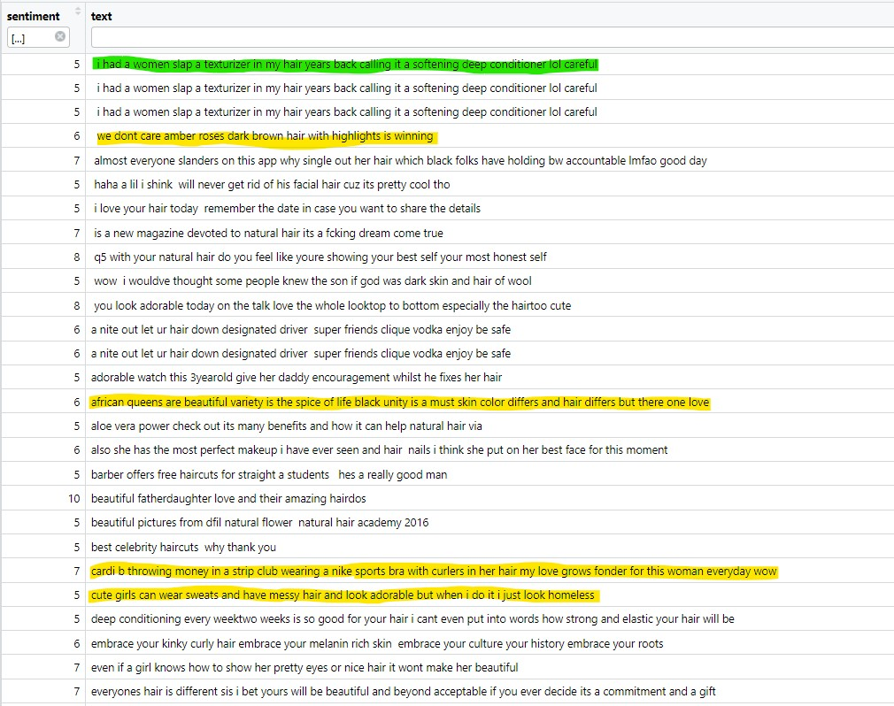

#### En el caso de tweats Positivos hablan de:


- Tweats genéricos en forma de amenaza ***(Subrayados en verde)***

- Tweats relacionados con una cantante ***(Amber Rose)***

- Tweats apoyando los canones de belleza Afroamericana.

- Tweats hablando de "body positive" posiblemente femenina Afroamericana 

- ...

# CONCLUSIONES

#### Este trabajo tenía como objetivo principal estudiar los principales "Temas Raros" que vimos en clase con el desglose del dataset de los tweets trolls de las elecciones Presidenciales de Donanld Trump en sobre el 2016/2018.

#### Entre algunos de esos temas raros se encontraban algunos como: 
- "hair loss"
- "natural hair"
- "got natual"
- "trumps hair"
- "youre racist"
- "lose weigth" ...

#### Entonces me quise centrar en los temas relacionados con el pelo dado que en su momento recuerdo como fue uno de los temas más "populares" de su campaña.
#### Siendo objeto de burla y mofa tanto por la oposicion como por los medios de comunicación.
#### Incluso se convirtió en un sello de identidad de la propia marca Trump con famosas escenas como las que protagonizo en el show de  show Jimmy Fallon.

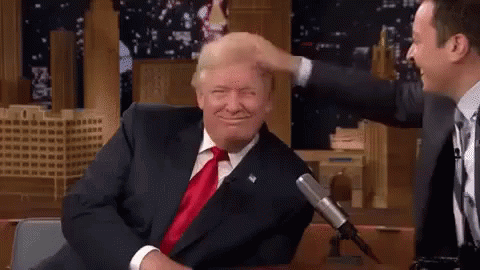


#### Por lo que hemos podido observar en el siguiente estudio vemos como cada uno de los diferentes "account_categories" del estudio se centran en diferentes enfoques respeto el tema en cuestión. Aunque ambos tienen un punto en común que lo expondré al final de la conclusión.

#### Vemos como sobre todo los tweets relacionados con RigthTroll se centran en hablar de temas relacionados con la política. 
#### Desde apoyos constantes a la melena del futuro presidente, como continuos ataques al resto de la oposición mediante burlas ya sea por su tipo de pelo o apariencias del mismo.

#### Algunos de los citados pueden ser Johon Mccain , Hillary Clinton o incluso ataques a medios Liberales.

#### Tambien hemos podido observar como este grupo introducia temas relacionados con deportes como el Baloncesto haciendo referencia a jugadores como : Allen Iverson o incluso referencias a las propias Kardashian.

#### También vemos como hay continuos tweets hablando de supuestas opresiones a la comunidad blanca Americana que apoya supuestamente a Trump con tokens comunes como "blond hair" o "claims blonde".

#### En cambio en el otro conjunto de Tweets es desde mi punto de vista el mas desconcertado me ha dejado pero a par mas interesante me ha parecido.

#### Vemos como los tweets relacionados con LeftTroll sus principales temas relacionados con el Pelo hacen referencia principalmente a dos cuestiones :

- #### La primera la belleza natural de las comunidades Afroamericanos ya sea con  "natural hair", "get natural" ,"black woman" o "black hairstyles" incluso al igual que en el anterior subconjunto hablando de temas de la comunidad "POP" como cantantes o actrices Afroamericanas

- #### Y la segunda un gran conjunto de tweets en forma de amenaza y ataques con jerga típicamente Afroamericana defendiendo diferentes temas como pueden ser la violencia policial , racismo , discriminacion cultural o simplemente respuestas a otros tweets pero de una forma agresiva.

## PUNTOS EN COMUN 
#### Dado este lio de tweets con diferentes puntos de vista a priori hay algo que les une.

#### Y es el spameo de ciertos comentarios por diferentes cuentas de un tweet determinado :

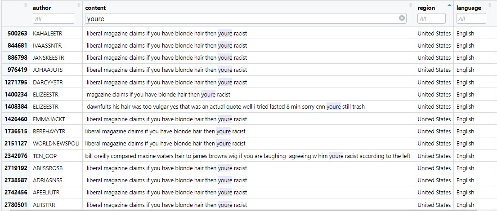

#### El ejemplo anterior es una muestra de los tweets de RigthTroll pero como comento anteriormente esto se repite en ambos espectros del dataset. En el que podemos ver como diferentes Usuarios repiten un Tweat de forma masiva y dependiendo del account_category hablan de unos temas u otros por ejemplo los de RigthTroll este tipo de Tweats son hablando de posibles discriminaciones que supuestamente sufren por los medios en cambio LeftTroll vemos como al igual que los anteriores están relacionados con posibles discriminaciones por su rasgos étnicos naturales pero lo mas interesante es como en ese spameo masivo de comentarios se hablan de temas no relacionados con la politica pero que en mi opinion siver de trampa para introducirlos en ciertos temas de la actualidad como por ejemplo alguno de los mas llamativos podrias ser : 
- #### Tweets relacionados con trucos para la caida del pelo .
- #### Trucos para sobre todo personas Afroamericana para cuidarse su pelo natural ..
- #### Comentarios de moda o belleza de : Actrices , Jugadores..

#### Los objetivos de estos tweets los desconozco pero desde el mero campo de la especulación creo que el objetivo de este grupo era cuanto menos incendiar las redes.
#### Sobre todo y lo más importante movilizar a diferentes tipos de personas a los distintos temas transcendentales del momento en cuestión y lo hacían de tal forma que intentaban incluir al máximo número de gente aun muchas veces estos fueran ajenos a la política ya sea hablando de temas como hemos nombrado anteriormente.


